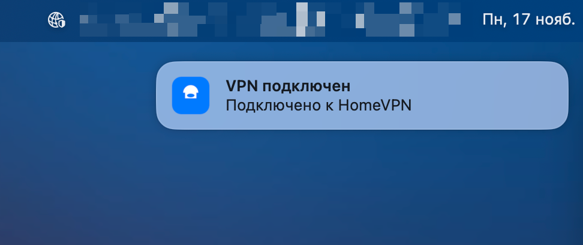
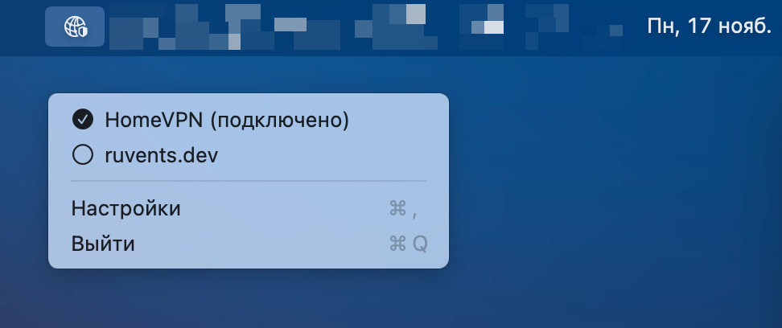

# VPN Bar

A lightweight and convenient menu bar application for macOS that allows you to quickly manage VPN connections directly from the menu bar.

## Description

VPN Bar is a native macOS application that lives in the menu bar and provides quick access to VPN connection management. The app automatically detects all configured VPN connections on your system and allows you to connect or disconnect with a single click.

## Screenshots

<table>
<tr>
<td align="center">
<a href="Files/screen-1.png" target="_blank">

</a>
</td>
<td align="center">
<a href="Files/screen-2.png" target="_blank">

</a>
</td>
<td align="center">
<a href="Files/screen-3.png" target="_blank">

</a>
</td>
</tr>
</table>

*Click on an image to view full size*

## Key Features

- **VPN Status Indication** — the menu bar icon shows whether there's an active VPN connection
  - Semi-transparent gray icon when no connection is active
  - Colored shield icon when VPN is connected
- **Quick Toggle** — left-click the icon to toggle the active VPN connection
- **Global Hotkeys** — configurable keyboard shortcut to toggle VPN from any application
- **Notifications** — system notifications when VPN connects or disconnects
- **Convenient Menu** — right-click opens a menu with all available VPN connections
- **Visual Indicators** — each VPN in the menu displays a status icon (connected/disconnected)
- **Flexible Settings** — configure refresh interval, notifications, and display options
- **Multilingual** — supports English, Russian, and Chinese (Simplified)
- **Lightweight** — minimal system resource usage

## Installation

### Using Homebrew (Recommended)

The easiest way to install VPN Bar is via [Homebrew](https://brew.sh/):

```bash
brew tap borzov/vpn-bar https://github.com/borzov/vpn-bar
brew install --cask vpn-bar
```

This method automatically handles macOS security (Gatekeeper) — no manual steps required.

To update:
```bash
brew upgrade --cask vpn-bar
```

### Manual Installation

1. Download the latest version from [Releases](https://github.com/borzov/vpn-bar/releases)
2. Extract the `VPNBarApp.zip` archive
3. Drag `VPNBarApp.app` to your Applications folder
4. Launch the application from Applications

**Note:** The technical name remains `VPNBarApp.app`, but it displays as "VPN Bar" in the system.

**Note:** On first launch, macOS may request permission to access the network extension. Allow access for the app to work correctly.

**Note:** If macOS shows a security warning, open **System Settings** → **Privacy & Security** and click **Open Anyway** next to the message about the app.

### Bypassing macOS Quarantine (Manual Installation Only)

If the app is blocked by macOS security (Gatekeeper), follow these steps:

1. Open **Terminal**
2. Run the command:
   ```bash
   sudo xattr -cr /Applications/VPNBarApp.app
   ```
3. If that doesn't work, try:
   ```bash
   sudo xattr -rd com.apple.quarantine /Applications/VPNBarApp.app
   ```
4. Then try launching the app again

Alternative method:
1. Open **System Settings** → **Privacy & Security**
2. Find the message about the blocked app
3. Click **Open Anyway**

## Usage

### Basic Actions

- **Left-click the icon** — toggles the active VPN connection (or the first available if none are active)
- **Right-click the icon** — opens the menu with VPN connections list
- **Click a VPN in the menu** — connects or disconnects the selected VPN
- **Hotkey** — configurable keyboard shortcut to toggle VPN from any application

### Settings

Open the menu and select "Settings" to access app preferences:

#### General
- **Status Update Interval** — configure how often the app checks VPN connection status (recommended: 10-15 seconds)
- **Notifications** — enable/disable system notifications when VPN connects or disconnects
- **Display** — show connection name in tooltip when hovering over the icon
- **Launch at Login** — automatically start the app at system login (macOS 13+)

#### Hotkeys
- **Toggle VPN** — set a global hotkey for quick VPN toggling
- Enhanced shortcut recording interface with visual modifier display and validation

#### About
- App information, version, and author
- Brief functionality description
- Direct link to the GitHub repository

## System Requirements

- macOS 12.0 (Monterey) or later
- Configured VPN connections in the system

## Auto-Start

To automatically launch the app at login:

1. Open **System Settings**
2. Go to **Users & Groups**
3. Select the **Login Items** tab
4. Click the **+** button and add `VPNBarApp.app` (displays as "VPN Bar")

## Development

The application is built with Swift and follows Apple's guidelines for native macOS app development.

### Building from Source

```bash
swift build -c release
./Scripts/package_app.sh
```

### Creating a Release

Releases are created automatically when pushing a tag in the `v*` format (e.g., `v0.5.3`):

```bash
# After finishing work on a version
git tag v0.5.3
git push origin v0.5.3
```

GitHub Actions will automatically:
- Build the application
- Create the .app bundle
- Package it into a ZIP archive
- Create a GitHub Release with the attached archive
